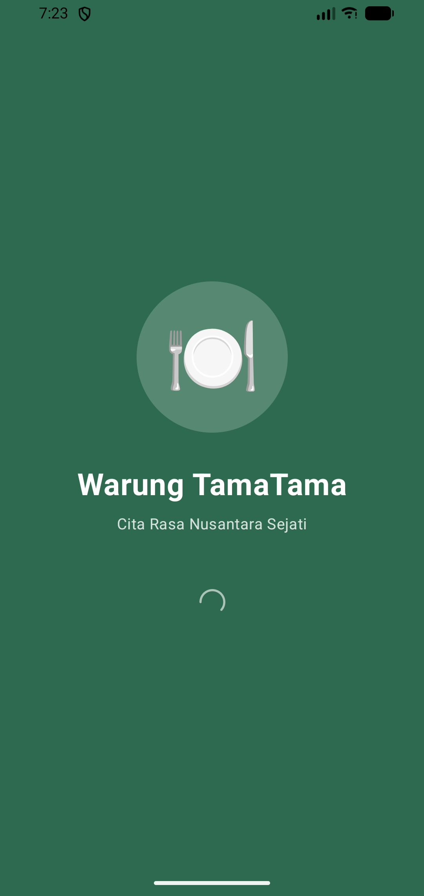
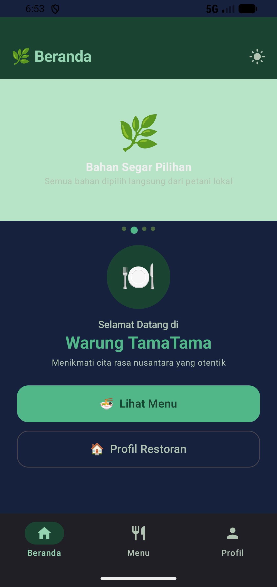
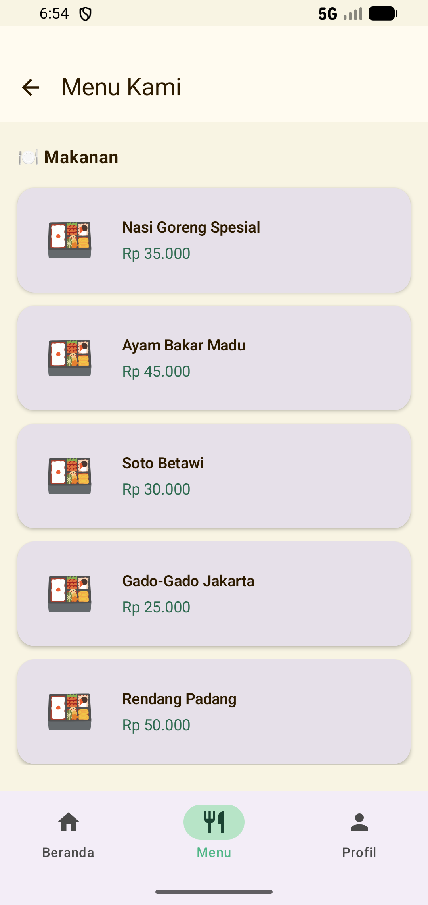
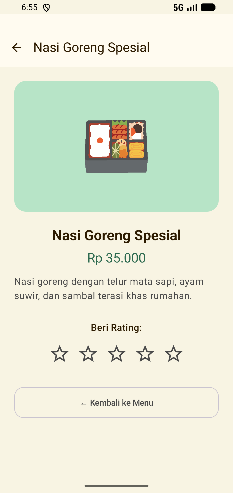
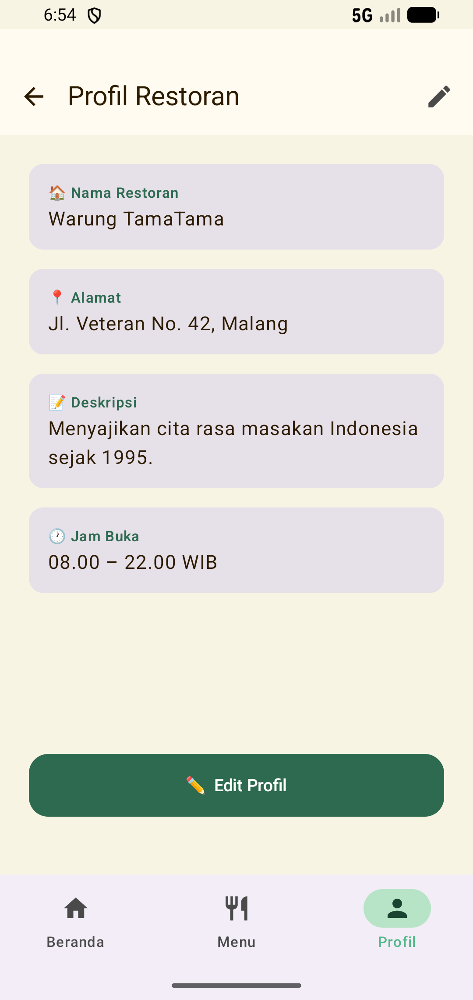
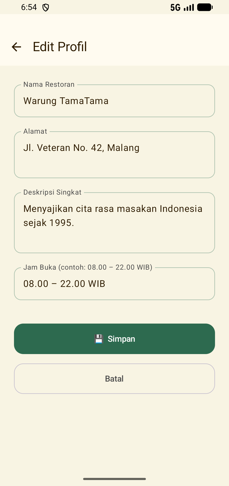
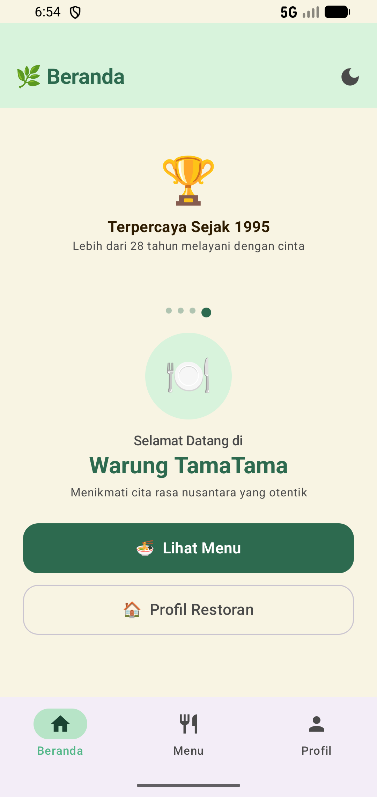

**RestoranApp**

Aplikasi Android untuk menampilkan profil dan menu restoran fiktif **Warung Nusantara**.
Dibangun menggunakan **Jetpack Compose** dengan tema Modern Natural 🌿

## Fitur Aplikasi

1. **Splash Screen** — Animasi logo bouncy saat pertama buka app
2. **Home Screen** — Carousel gambar otomatis + nama restoran dari SharedPreferences
3. **Menu Screen** — Daftar 8 menu (makanan & minuman)
4. **Detail Menu** — Detail lengkap + rating bintang interaktif ⭐
5. **Profile Screen** — Data profil restoran dari SharedPreferences
6. **Edit Profile** — Form edit & simpan data ke SharedPreferences
7. **Bottom Navigation Bar** — Navigasi cepat antar layar
8. **Dark/Light Mode** — Toggle tema tersimpan di SharedPreferences
9. **Animasi Transisi** — Slide horizontal, slide vertical, fade in/out

## Navigasi

Home ←→ Menu → Detail Menu
↕
Profile ←→ Edit Profile

## Teknologi

| Teknologi | Keterangan |
|---|---|
| Kotlin | Bahasa pemrograman |
| Jetpack Compose | UI Framework |
| Navigation Compose | Navigasi antar layar |
| SharedPreferences | Penyimpanan data lokal |
| Material3 | Design system |

---

## 📸 Screenshot

### Splash Screen & Home Screen



### Menu & Detail Menu



### Profile & Edit Profile



### Dark Mode



## Cara Menjalankan

1. Clone repository ini
```bash
git clone https://github.com/arandabima/RestoranApp.git
```
2. Buka dengan **Android Studio**
3. Jalankan di emulator atau perangkat fisik (**Min SDK API 24**)

## 👨‍💻 Developer

Dibuat dengan menggunakan Jetpack Compose
